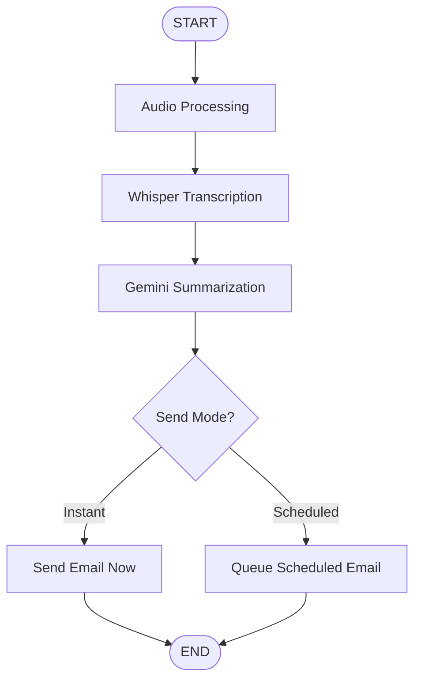

# 🎙️ Voice Agent Flow Application

A production-ready voice processing application built with Next.js, LangGraph, and AI services. Record or upload audio, get AI-powered summaries, and receive them via email—instantly or scheduled.

## 🌟 Features

- **🎤 Voice Recording**: Record audio directly in the browser (up to 3 minutes)
- **📁 File Upload**: Upload existing audio files (WAV, MP3, WEBM, OGG)
- **✨ AI Transcription**: Powered by OpenAI Whisper
- **🤖 Smart Summarization**: Google Gemini Flash 3 Preview via OpenRouter
- **📧 Email Delivery**: Instant or scheduled email delivery via Resend
- **📊 Observability**: Complete tracing with LangSmith
- **🏗️ SOLID Architecture**: Clean, maintainable codebase following best practices

## 🎯 Architecture

This application uses **LangGraph** for workflow orchestration with the following flow:



### Technology Stack

**Frontend:**
- Next.js 16 (App Router)
- TypeScript
- Tailwind CSS v4
- shadcn/ui components
- react-media-recorder

**Backend/AI:**
- **LangGraph** - Workflow orchestration
- **LangSmith** - Tracing & observability
- **OpenAI Whisper** - Audio transcription
- **Google Gemini** (via OpenRouter) - Text summarization
- **Resend** - Email delivery
- **node-cron** - Job scheduling

## 📁 Project Structure

```
/app
  /api
    /voice-agent
      route.ts              # Main API endpoint
  /voice-agent
    page.tsx                # Main UI page
/lib
  /graph
    voiceAgentGraph.ts      # LangGraph assembly
  /nodes
    audioProcessingNode.ts
    transcriptionNode.ts
    summarizationNode.ts
    emailDecisionNode.ts
    emailNode.ts
    schedulingNode.ts
  /services
    /transcription
      WhisperService.ts
    /summarization
      OpenRouterService.ts
    /email
      ResendService.ts
    /scheduling
      CronScheduler.ts
  /interfaces
    VoiceAgentState.ts
    ServiceTypes.ts
    ApiTypes.ts
  /utils
    audioValidation.ts
    emailTemplates.ts
    /graph
      tracing.ts
/components
  /voice-agent
    VoiceRecorder.tsx
    AudioUploader.tsx
    EmailForm.tsx
    TranscriptionPreview.tsx
    SummaryDisplay.tsx
    StatusTracker.tsx
```

## 🚀 Getting Started

### Prerequisites

- Node.js 20+ or Bun
- API Keys (see below)

### Required API Keys

You'll need accounts and API keys from:

1. **OpenAI** - For Whisper transcription
   - Get key: https://platform.openai.com/api-keys
   
2. **OpenRouter** - For Google Gemini access
   - Get key: https://openrouter.ai/keys
   
3. **Resend** - For email delivery
   - Get key: https://resend.com/api-keys
   
4. **LangSmith** (Optional but recommended) - For tracing
   - Get key: https://smith.langchain.com/

### Installation

1. **Clone and install dependencies:**
   ```bash
   bun install
   ```

2. **Set up environment variables:**
   ```bash
   cp .env.local.example .env.local
   ```

3. **Edit `.env.local` with your API keys:**
   ```env
   # LangSmith (for tracing)
   LANGCHAIN_TRACING_V2=true
   LANGCHAIN_ENDPOINT=https://api.smith.langchain.com
   LANGCHAIN_API_KEY=your_langsmith_key
   LANGCHAIN_PROJECT=voice-agent-flow

   # OpenAI (Whisper)
   OPENAI_API_KEY=your_openai_key

   # OpenRouter (Gemini)
   OPENROUTER_API_KEY=your_openrouter_key
   OPENROUTER_MODEL=google/gemini-flash-1.5

   # Resend (Email)
   RESEND_API_KEY=your_resend_key
   EMAIL_FROM="Voice Agent <onboarding@resend.dev>"
   ```

4. **Run the development server:**
   ```bash
   bun run dev
   ```

5. **Open the application:**
   Navigate to [http://localhost:3000/voice-agent](http://localhost:3000/voice-agent)

## 📖 Usage

1. **Record or Upload Audio**
   - Click the microphone icon to record (up to 3 minutes)
   - OR upload an existing audio file (WAV, MP3, WEBM, OGG)

2. **Configure Email Delivery**
   - Enter recipient email address
   - Choose "Instant" or "Scheduled" delivery
   - If scheduled, select date and time

3. **Process**
   - Click "Process Voice Input"
   - Watch the progress as it:
     - Transcribes audio with Whisper
     - Generates summary with Gemini
     - Sends or schedules email

4. **Review Results**
   - View transcription
   - See structured summary with bullet points
   - Get "Next Step" recommendation

## 🔍 LangSmith Tracing

This application is fully instrumented with LangSmith for observability.

### Viewing Traces

1. Enable tracing in `.env.local`:
   ```env
   LANGCHAIN_TRACING_V2=true
   ```

2. Run the application and process audio

3. Visit your LangSmith dashboard:
   https://smith.langchain.com/

4. Navigate to your project (`voice-agent-flow`)

5. View detailed traces including:
   - Input/output for each node
   - Execution time
   - Token usage
   - Error details (if any)

## 🏗️ Architecture Principles

This application follows **SOLID** principles:

- **Single Responsibility**: Each service handles one concern
- **Open/Closed**: Services are swappable via interfaces
- **Liskov Substitution**: All services implement interfaces
- **Interface Segregation**: Focused, minimal interfaces
- **Dependency Injection**: No tight coupling

## 🚀 Deployment

### Vercel (Recommended)

1. **Push to GitHub/GitLab**

2. **Import to Vercel:**
   - Connect your repository
   - Vercel auto-detects Next.js

3. **Add Environment Variables:**
   - Go to Project Settings → Environment Variables
   - Add all variables from `.env.local`

4. **Deploy:**
   - Vercel will build and deploy automatically
   - Get your live URL: `https://your-app.vercel.app/voice-agent`

### Important Notes

- **Scheduled Emails**: Using node-cron means scheduled jobs are in-memory. For production:
  - Use Vercel Cron Jobs
  - Or external service like Trigger.dev, Inngest, or QStash
  
- **Audio File Size**: Max 25MB (Whisper API limit)

- **Execution Time**: Transcription + Summarization typically takes 5-15 seconds

## 💰 Cost Estimates

Per voice input (3-minute audio):

- **Whisper Transcription**: ~$0.018
- **Gemini Summarization**: ~$0.001
- **Resend Email**: Free tier (100 emails/day)

**Total**: ~$0.02 per voice input

## 🔧 Customization

### Change LLM Model

Edit `OPENROUTER_MODEL` in `.env.local`:
```env
OPENROUTER_MODEL=anthropic/claude-3-5-sonnet  # Use Claude instead
```

### Change Email Provider

1. Implement new service extending `IEmailService`
2. Update `emailNode.ts` to use new service
3. Update environment variables

### Adjust Audio Limits

Edit in `.env.local`:
```env
MAX_AUDIO_DURATION_MS=300000  # 5 minutes
MAX_AUDIO_SIZE_MB=50          # 50MB
```

## 🐛 Troubleshooting

### Audio Recording Not Working

- **Issue**: Browser doesn't support MediaRecorder
- **Solution**: Use Chrome, Firefox, or Edge (latest versions)

### "Missing API Key" Error

- **Issue**: Environment variable not set
- **Solution**: Check `.env.local` has all required keys
- Restart dev server after adding keys

### Transcription Fails

- **Issue**: Audio file too large or wrong format
- **Solution**: Use MP3/WAV under 25MB, max 3 minutes

### Email Not Sending

- **Issue**: Invalid Resend API key or email address
- **Solution**: 
  - Verify API key at resend.com
  - Use verified sender domain (not @resend.dev in production)

### Scheduled Emails Not Sending

- **Issue**: Server restarted (in-memory cron)
- **Solution**: For production, use external cron service

## 📄 License

MIT

## 🙏 Acknowledgments

- Built with [LangChain](https://langchain.com/) and [LangGraph](https://langchain-ai.github.io/langgraph/)
- UI components from [shadcn/ui](https://ui.shadcn.com/)
- Powered by OpenAI, Google, and Resend

---

**Made with ❤️ using Next.js, LangGraph, and AI**
